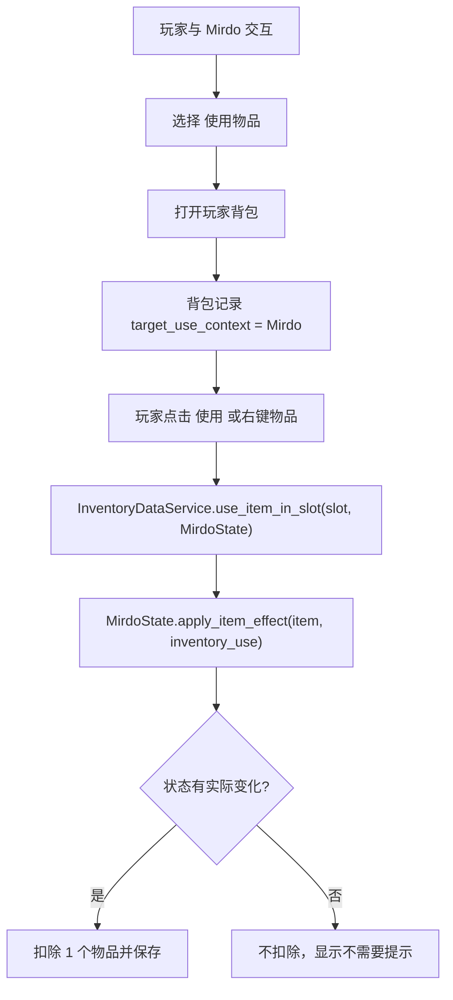

# Mirdo 上下文物品使用设计

**Date**: 2026-05-20  
**Project**: FPS / Godot 4  
**Feature**: 物品使用入口与 Mirdo 目标上下文  
**Status**: Draft for user review

## 目标

为当前背包物品补上“使用”操作，并支持玩家通过 Mirdo 的交互选项打开背包，把可用物品直接用于 Mirdo。该设计避免每次使用都弹目标选择，同时保留玩家自己使用物品的能力。

## 当前上下文

现有底层已经具备大部分数据能力：

- `res://scripts/Inventory/ItemData.gd` 已包含 `can_use`、`health_delta`、`hunger_delta`、`thirst_delta` 与 `is_usable()`。
- `res://scripts/Inventory/inventory_data_service.gd` 已包含 `use_item_in_slot(slot_index, target_state)`，成功后会扣除 1 个物品并触发保存。
- `res://scripts/character_resources/character_resource_state_component.gd` 已包含 `apply_item_effect(item, reason)`，能应用 `health / hunger / thirst` 变化。
- 现有可直接使用的物品主要是食物、水和医疗品，例如罐头、瓶装水、绷带、消毒药、止痛药、急救箱。

缺口在于：缺少清晰的 UI/交互入口、目标解析规则和 Mirdo 上下文。

## 用户交互设计

### 1. 玩家自己使用

当玩家直接打开自己的背包时：

- 选中可用物品后，详情区域显示 `使用` 或 `自己使用`。
- 右键可用物品格也触发同一逻辑。
- 使用目标默认为玩家自己的 `CharacterResourceStateComponent`。

### 2. 给 Mirdo 使用

Mirdo 的角色交互菜单新增一个选项：`使用物品`。

玩家对 Mirdo 执行该交互后：

1. 打开玩家背包。
2. 背包进入 `target_use_context = Mirdo` 模式。
3. 详情按钮显示 `给 Mirdo 使用`。
4. 右键可用物品格也等同于 `给 Mirdo 使用`。
5. 成功使用后从玩家背包扣除 1 个物品，效果应用到 Mirdo 的状态组件。

这意味着目标不是通过弹窗选择，而是由“从 Mirdo 交互入口打开背包”这个上下文决定。

## 使用规则

物品满足以下任一条件即可显示为可用：

- `ItemData.can_use == true`
- `ItemData.get_consumable_delta()` 非空

使用时：

- 若目标存在并有 `apply_item_effect(item, reason)`，尝试应用效果。
- 若目标状态发生实际变化，扣除 1 个物品。
- 若目标状态已满或没有实际变化，不扣除物品，并显示提示。
- 若物品不可用，按钮禁用或显示 `不可直接使用`。

推荐提示文案：

- 给 Mirdo 成功：`已给 Mirdo 使用：{ItemName}`
- 给自己成功：`已使用：{ItemName}`
- Mirdo 不需要：`Mirdo 当前不需要这个`
- 玩家不需要：`当前不需要使用`
- 不可直接使用：`该物品不能直接使用`

## 物品分类策略

### 立即支持直接使用

- 食物：恢复 `hunger`
- 水/饮品：恢复 `thirst`
- 医疗品：恢复 `health`

### 暂不做直接使用

以下类型先保留给后续场景/装备系统：

- 工具：撬棍、手电、发电机等
- 材料：电池、胶带、燃料、电力芯等
- 武器：小刀、消防斧、铁管等
- 特殊物：地图册等

这些物品可在描述中提示用途，但背包内不直接消耗。

## 数据流

## 组件边界

### Mirdo 交互组件

负责：

- 在 Mirdo 的交互选项中提供 `使用物品`。
- 调用背包 UI 打开方法，并传入 Mirdo 的状态组件引用或目标节点引用。

不负责：

- 直接改背包数据。
- 直接扣除物品。

### 背包 UI / HoloInventory 视图

负责：

- 记录当前使用目标上下文。
- 根据上下文显示 `自己使用` 或 `给 Mirdo 使用`。
- 把格子索引和目标状态组件传给 `InventoryDataService`。
- 显示成功/失败提示。

不负责：

- 计算物品效果。
- 修改角色状态细节。

### InventoryDataService

负责：

- 校验物品是否可用。
- 调用目标状态组件应用效果。
- 成功后扣除物品。
- 发出 `item_used` 信号并触发保存。

可以保留现有 `use_item_in_slot(slot_index, target_state)` 主接口，必要时小幅补充失败原因查询，但避免把 UI 文案写进数据层。

### CharacterResourceStateComponent

负责：

- 按 `ItemData.get_consumable_delta()` 应用 `health / hunger / thirst`。
- 返回实际应用的变化。

无需关心物品来自谁的背包。

## 文案更新

把旧的“小空”相关物品说明统一改为 Mirdo，例如：

- 罐头：`适合给 Mirdo 补充饱食度。`
- 瓶装水：`可给 Mirdo 补充水分。`

如果代码或 UI 中存在 `xiaokong` 作为历史节点/脚本名，除非影响玩家可见文案，本功能不强制重命名，避免扩大改动范围。

## 错误处理

- 找不到 Mirdo 状态组件：不打开目标模式，提示 `找不到 Mirdo 状态组件`。
- 背包没有可用物品：允许打开背包，但可用按钮保持禁用。
- 目标已满状态：不扣物品。
- 使用过程中背包关闭：清空 `target_use_context`，下次直接打开背包恢复默认自己使用。

## 验收标准

- 玩家直接打开背包时，可用物品能用于玩家自己。
- 与 Mirdo 交互并选择 `使用物品` 后，背包中可用物品会作用到 Mirdo。
- 给 Mirdo 使用成功后，玩家背包对应物品数量减少 1。
- Mirdo 对应 `health / hunger / thirst` 实际增加。
- Mirdo 状态已满时，不消耗物品，并有清晰提示。
- 不可用物品不会被消耗。
- 右键物品与点击使用按钮走同一目标上下文。
- 所有玩家可见“小空”物品使用文案改为 Mirdo。

## 非目标

本次不实现：

- 目标选择弹窗。
- 装备栏、武器装备、战斗使用。
- 手电/电池/发电机等场景设备逻辑。
- 大规模重命名 `xiaokong` 历史资源路径。
